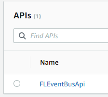
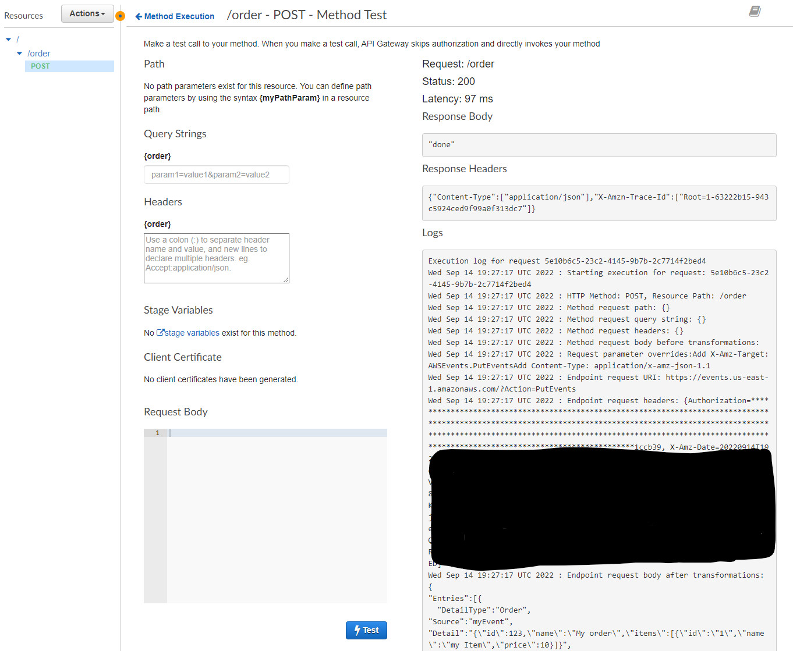
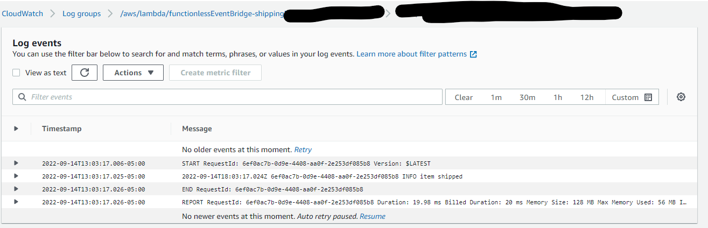

# Use an Event Bus with Functionless

In this example, we'll create an event based application that uses [AWS EventBridge](https://aws.amazon.com/eventbridge/) to trigger business logic in [Lambda Functions](https://docs.aws.amazon.com/lambda/latest/dg/welcome.html).

We'll also create a REST API in [API Gateway](https://aws.amazon.com/api-gateway/) as a method to create events in the bus.

Finally we'll deploy and test the application.

To see the completely application, go [here](https://github.com/functionless/functionless-samples/packages/eventBridge).

## Create an new app

> yarn create functionless

For a more detailed guide, see: https://functionless.org/docs/getting-started/setup

## Create basic Lambda Functions

We'll want function that get called when an event happens.

Replace your `app.ts` with (the imports will be useful later):

```ts
import { App, Stack } from "aws-cdk-lib";
import { RestApi } from "aws-cdk-lib/aws-apigateway";
import { AwsMethod, Event, EventBus, Function } from "functionless";

const app = new App();
const stack = new Stack(app, "functionlessEventBridge");

const receipt = new Function(stack, "receipt", async () => {
  console.log("receipt sent!");
});
const shipping = new Function(stack, "shipping", async () => {
  console.log("item shipped");
});
```

## Create a new Event Bus

An Event Bus is a resource which can be sent and then broadcast events.

```ts
const bus = new EventBus(stack, "OrdersBus");
```

Here we are creating a new event bus, but it is also possible to use the [default event bus](https://functionless.org/docs/concepts/event-bridge/event-bus#default-bus) found on your aws account.
There is no cost when creating an event bus, only when events are sent to and from it! Though there is a limit of 100 buses per account.

## Add types to the event bus

Lets plan what our events will look like

Replace the EventBus line with

```ts
interface Order {
  id: number;
  name: string;
  items: { id: string; name: string; price: number }[];
}

interface OrderEvent extends Event<Order, "Order", "myEvent"> {}

const bus = new EventBus<OrderEvent>(stack, "Ordered");
```

Now when we work with the bus, the operations will be type safe for the events the bus expects.

## Create Rules

When a new order comes into the system, we want to trigger our functions above.

Our bus could see many event types in the future, we want to make sure only the right events trigger the function.

```ts
const whenOrder = bus.when(
  "rule1",
  (event) => event.source === "myEvent" && event["detail-type"] === "Order"
);
```

This create a new Event Bridge rule on the bus.

## Triggering the Functions

Now lets trigger the functions.

```ts
whenOrder.pipe(receipt);
whenOrder.pipe(shipping);
```

When our `whenOrder` rule is triggered by event, both lambda functions will be triggered.

## Sending Events

There are many ways to send events to event bridge, but for this demo, we'll create an API Gateway REST path that triggers the function.

Add:

```ts
const api = new RestApi(stack, "FLEventBusApi");
const order = api.root.addResource("order");

new AwsMethod(
  { httpMethod: "POST", resource: order },
  async () =>
    bus.putEvents({
      "detail-type": "Order",
      source: "",
      detail: {
        id: 123,
        name: "My order",
        items: [{ id: "1", name: "my Item", price: 10 }],
      },
    }),
  () => {
    return "done";
  }
);
```

This will create a route `POST [domain]/prod/order` which calls this method:

```ts
 async () =>
    bus.putEvents({
      "detail-type": "Order",
      source: "myEvent",
      detail: {
        id: 123,
        name: "My order",
        items: [{ id: "1", name: "my Item", price: 10 }],
      },
    }),
```

While this looks like a lambda function, this code is actually being compiled down the Velocity (VTL), the language which API gateway uses to transform requests.

This operation is also type safe, try changing the source to `"anotherEvent"`, your IDE should show an error (and then change it back).

## Permissions

But wait, when do I create policies and permissions for my resources to talk to each other?

Functionless handles this automatically. When you `.pipe()` to your lambda functions, a policy is created that grants access for EventBus to call Lambda. likewise, a policy is created to allow API Gateway to call `PutEvents` on the event bus used in `AwsMethod`.

## Deploy

To deploy, run:

> yarn deploy

For a more in depth overview of the deployment process, see [deploy project](https://functionless.org/docs/getting-started/deploy-project).

## Testing

We'll use the AWS Console UI to test our API.

### Invoke API to Send Event

We created a REST API to send events to our new event bus. Lets invoke that API.

Navigate to the [API Gateway UI](console.aws.amazon.com/apigateway) in the console and find your API, it should be called `FLEventBusApi`.



Note: if you don't see your API, make sure your deployment succeeded and you are in the same region you deployed to.

Find the POST API and execute the API to test it (no input is needed).



### Verify Execution

Now that we sent an event, we should can look at the logs to see if the event went through.

1. Go the lambda UI
2. Find search for "shipping"
3. click on the function name
4. click on monitoring
5. click on view cloudwatch logs

There should be a log stream, in that log stream you should see the message `item shipped`. Go back to step 2 and repeat for `receipt`.


